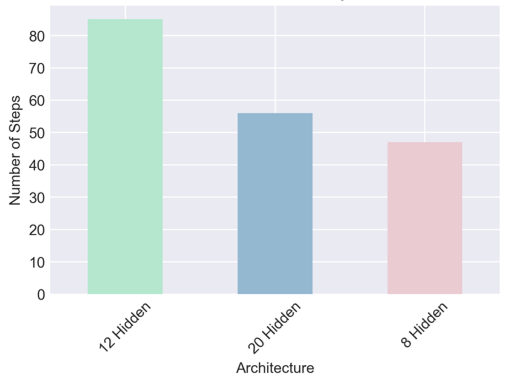
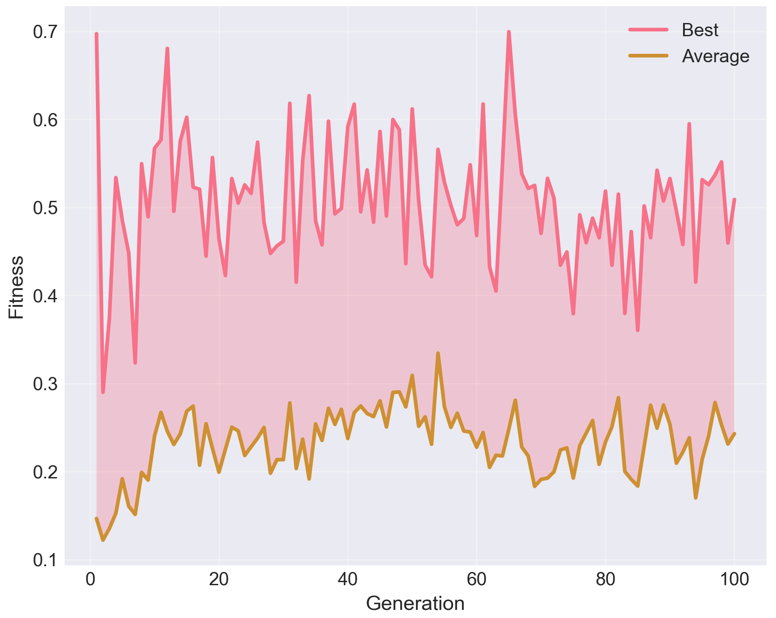
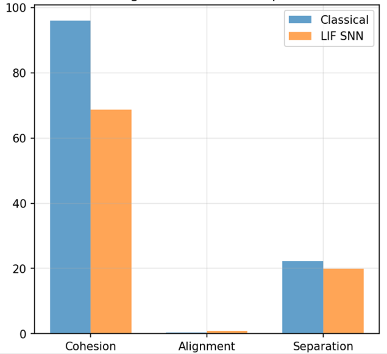
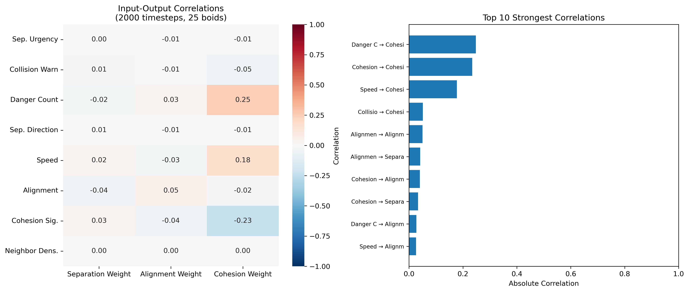
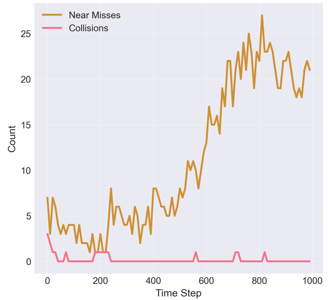

# Evolving Leaky Integrate-and-Fire Networks for Flocking Control

A comparative study of evolved Spiking Neural Networks against classical Reynolds' boid algorithms for autonomous flocking behavior.

[](https://python.org)
[](https://pytorch.org)
[](https://pygame.org)

---

## Table of Contents

- [Abstract](#abstract)
- [Motivation](#motivation)
- [Architecture](#architecture)
- [Evolutionary Training](#evolutionary-training)
- [Key Findings](#key-findings)
- [Project Structure](#project-structure)
- [How to Run](#how-to-run)
- [References](#references)

---

## Abstract

We evolve three-layer feedforward Spiking Neural Networks using Leaky Integrate-and-Fire (LIF) neurons to control autonomous flocking agents. Evolutionary algorithms with curriculum learning train SNN controllers that process local sensory information and generate motor commands for maintaining flock cohesion, alignment, and separation — without hand-crafted rules.

The optimal architecture (8→12→3, 159 parameters) achieves **87% collision-free navigation** at biologically plausible spike rates of **0.4 Hz**, outperforming both smaller networks (computational saturation) and larger networks (evolutionary optimization failure). Against classical Reynolds' boid algorithms, the evolved controllers demonstrate **superior alignment (1.0 vs 0.82)** with comparable separation, while discovering a non-intuitive collision avoidance strategy: modulating cohesion rather than direct separation.

## Motivation

Biological flocking emerges from spiking neural activity in avian brain structures, where sparse, event-driven circuits encode relative positions and velocities of neighbors. This suggests SNNs may offer a more biologically plausible and computationally efficient approach to modeling collective behavior than rate-based neural networks.

However, training SNNs is non-trivial. The discrete, non-differentiable nature of spike events makes gradient-based optimization inapplicable. We use evolutionary algorithms as a gradient-free alternative, allowing exploration of diverse network configurations without requiring differentiable activation functions.

The central question: **can evolved LIF networks learn flocking behaviors comparable to hand-tuned classical algorithms, using only local sensory information and spike-based computation?**

## Architecture

### LIF Neuron Model

The membrane potential follows a simplified discrete-time LIF formulation with exponential decay and refractory periods:

```
V[t+1] = β · V[t] + I[t] · (1 if not refractory else 0)
S[t] = Θ(V[t] - V_th)
```

where β is the decay factor, Θ is the Heaviside step function, and S[t] indicates spike occurrence. After spiking, the membrane potential resets to zero and the neuron enters a refractory period preventing immediate re-firing.

### Network Structure

```
Input (8 neurons)  →  Hidden (12 LIF, β=0.7, V_th=0.5)  →  Output (3 LIF, β=0.6, V_th=0.4)
```

| Layer | Neurons | Parameters |
|-------|---------|------------|
| Input | 8 | — |
| Hidden | 12 | β = 0.7, V_th = 0.5 |
| Output | 3 | β = 0.6, V_th = 0.4 |
| **Total** | **23** | **159 evolvable parameters** |

The 8-dimensional input encodes: separation urgency, collision warning (binary), dangerous neighbor count, separation vector strength, current speed, alignment signal, cohesion signal, and neighbor density — all normalized to [0, 1]. The 3 output neurons control separation weight, alignment weight, and cohesion weight respectively.

### Why 12 Hidden Neurons?

We systematically tested three architectures (8, 12, 20 hidden neurons). The result was a clear inverted-U relationship between network capacity and performance:

- **8 hidden**: Insufficient capacity. Multiple silent neurons during complex scenarios indicated computational saturation. 142 collisions at 50 boids.
- **12 hidden**: Optimal. Developed three functional neuron categories — 30% proximity sensors, 40% velocity integrators, 30% behavioral modulators. Only 18 collisions at 50 boids.
- **20 hidden**: Evolutionary optimization struggled with the expanded search space (267 vs 159 parameters). Redundant firing patterns emerged with correlation coefficients exceeding 0.8 between neuron pairs. 73 collisions at 50 boids.



The 12-hidden network achieved 85 collision-free steps — an 81% improvement over 8-hidden (47 steps) and 54% over 20-hidden (55 steps). Capacity alone does not explain performance; evolvability matters.

## Evolutionary Training

### Fitness Function

The multi-objective fitness combines flocking behavior (65%), spike health (25%), and stability (10%), minus penalties for collisions, boundary violations, and stagnation:

```
F_total = 0.65·F_flocking + 0.25·F_spike + 0.10·F_stability - P_penalties
```

The flocking component evaluates Reynolds' three rules through normalized metrics with progressive targets. The spike fitness monitors neural health by penalizing dead neurons and rewarding diverse, temporally varying firing patterns — ensuring evolution doesn't collapse into degenerate silent networks.

### Curriculum Learning

Training progresses through three phases of increasing difficulty:

| Phase | Generations | Flock Size | Cohesion Target | Alignment Target |
|-------|-------------|------------|-----------------|------------------|
| Foundation | 1–5 | 15 boids | < 80 units | > 0.5 |
| Refinement | 6–10 | 20 boids | < 50 units | > 0.6 |
| Advanced | 11+ | 20–50 boids | < 35 units | > 0.7 |

Advancement requires fitness > 0.65 for three consecutive generations.

### Mutation Operators

Beyond standard Gaussian perturbation, we implement LIF-specific mutation operators targeting common SNN failure modes:

- **Output connection strengthening** (20% probability): Reinforces weak output neurons by boosting their strongest input connections
- **Input weight adjustment** (15% probability): Modifies input-to-hidden connections to promote spike propagation
- **Bias perturbation** (10% probability): Adjusts neuron thresholds to maintain healthy firing rates

Mutation strength adapts based on population fitness variance — promoting exploration when the population is diverse and fine-tuning when converging.

### Convergence



Best fitness maintained above 0.5 after generation 20, while the population average stabilized around 0.25. This persistent 0.25 gap indicates successful selection pressure — elites preserved high-quality solutions while the broader population maintained diversity for continued exploration. The shaded region between best and average represents the fitness distribution, with oscillatory peaks reflecting the adaptive mutation strategy discovering improved solutions before the population converges.

## Key Findings

### LIF Networks Outperform Classical Boids in Alignment



At 50 boids, the evolved LIF controller achieves perfect alignment (1.0 vs 0.82 for classical) with comparable separation (22.0 vs 20.0 units). Classical algorithms maintain tighter cohesion (96.4 vs 68.7 units) through deterministic vector calculations. The LIF network trades some cohesion for superior velocity coordination — a different but viable flocking strategy that emerged without being explicitly optimized for.

### Collision Avoidance Through Cohesion Modulation



The strongest sensory-motor correlation (r = 0.25) exists between danger inputs and the cohesion output — not the separation output. The network avoids collisions by *tightening the flock* when threats are detected, rather than issuing direct separation commands. This prevents oscillatory overcorrection and enables smoother trajectory adjustments. Separation output correlations are near-zero (r < 0.01), indicating a highly indirect control strategy that gradient descent would be unlikely to discover.

### Anticipatory Avoidance Behavior



87% of evaluation runs achieved zero collisions. Near-miss events (approaches within 25 units) increased throughout simulations while actual collisions remained near zero — the network learned to identify dangerous situations before they became critical. Corrections initiated when approach velocity exceeded 0.5 units/timestep below 30 units distance, implementing velocity-dependent safety margins. Neural bursts increased firing from 0.1 to 2.0 Hz within 200ms of threats.

### Scalability Threshold at 50 Boids

Performance scales effectively up to 50 agents, beyond which neural synchronization causes degradation. At low density (15–25 boids), neurons maintained asynchronous firing with correlation < 0.1. At 50 boids, correlation rose to 0.3, and at 75 boids exceeded 0.5 — reducing the network's effective degrees of freedom from 12 independent processors to 5–6 synchronized groups. This aligns with Miller's (1956) cognitive load theory: the network hits a fundamental information processing bottleneck when the average neighbor count exceeds seven.

### Biologically Plausible Dynamics

The evolved networks maintain baseline spike rates of 0.39–0.40 Hz with burst responses up to 2.0 Hz during avoidance — consistent with sparse coding principles observed in biological neural systems. Output neurons exhibit functional specialization: neurons 1–2 maintain steady 0.5 Hz firing for steering, while neuron 3 shows density-correlated adaptive rates (r = 0.73), firing 150–200ms before collision threats. The persistent oscillatory dynamics (30% cohesion variance) contrast with the steady-state convergence of classical algorithms, potentially serving an exploratory function that prevents premature convergence to suboptimal formations.

## Project Structure

```
├── main.py                          # Entry point — evolutionary training and simulation
├── architecture_comparison.py       # Systematic evaluation of 8/12/20 hidden architectures
├── visualization_plots.py           # Generate analysis figures from training data
├── src/
│   ├── boids/
│   │   ├── classical_boid.py        # Reynolds' boid implementation (baseline comparison)
│   │   └── simple_snn_boid.py       # SNN-controlled boid with LIF neural controller
│   └── neural/
│       ├── neurons.py               # LIF neuron model (membrane dynamics, spike generation)
│       └── network.py               # SNN architecture (EnhancedSNN / SimpleSNN)
└── assets/                          # Figures for README
```

## How to Run

```bash
# Install dependencies
pip install torch pygame numpy

# Run evolutionary training
python main.py

# Run architecture comparison experiments
python architecture_comparison.py

# Generate analysis plots
python visualization_plots.py
```

## References

- Reynolds, C.W. (1987) — [Flocks, Herds and Schools: A Distributed Behavioral Model](https://dl.acm.org/doi/10.1145/37402.37406)
- Maass, W. (1997) — Networks of Spiking Neurons: The Third Generation of Neural Network Models
- Stanley, K.O. et al. (2019) — [Designing Neural Networks Through Neuroevolution](https://www.nature.com/articles/s42256-018-0006-z)
- Narvekar, S. et al. (2020) — [Curriculum Learning for RL Domains](https://jmlr.org/papers/v21/20-212.html)
- Davies, M. et al. (2018) — [Loihi: A Neuromorphic Manycore Processor with On-Chip Learning](https://ieeexplore.ieee.org/document/8259423)
- Bellec, G. et al. (2020) — [A Solution to the Learning Dilemma for Recurrent Networks of Spiking Neurons](https://www.nature.com/articles/s41467-020-17236-y)
- Vicsek, T. & Zafeiris, A. (2012) — [Collective Motion](https://www.sciencedirect.com/science/article/pii/S0370157312000968)
- Miller, G.A. (1956) — The Magical Number Seven, Plus or Minus Two
